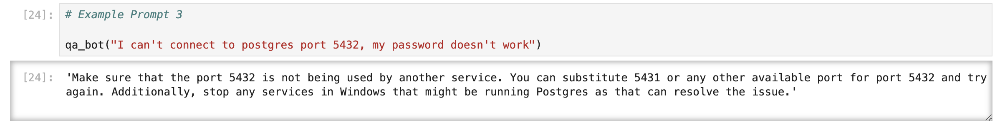

# Creating an AI Chatbot!

* Part of the Data Talks Club LLM Zoomcamp
* Connecting to the Open AI API.
* __The code and notes are contained in the Jupyter Notebook called 'ElasticRAG' saved in this repo.__

## The Task 📝

* Using RAG (Retrieval Augmented Generation) to create a chatbot based on a document containing FAQs about various courses hosted by DataTalksClub.
* The FAQ document is +25 pages long, so it is easy for users to overlook anwsers, or fail to look through the document altogether.
* A chatbot helps solve this problem as it is an easy and intuitive way to find anwsers to questions quickly.
* The chatbot works by searching for words in the question in the context given (the JSON file), it bases its anwsers only on this.

## Tools & Libraries Used 🧰

* Python
* Open AI API
* ElasticSearch
* Docker
* pipenv
* JSON files
* Jupyter Notebook

## Example Output 📖

Here is an example of the Q&A between user and the chatbot! The user asks "I can't connect to postgres port 5432, my password doesn't work" and gets a sensible response from the chatbot 🏆

## Resources and Shout-Outs 📚
* Thank you to the DataTalksClub and the tutorial hosted by @alexeygrigorev 
* You can access the course repo here: [Link to LLM Zoomcamp hosted by DataTalksCkub](https://github.com/DataTalksClub/llm-zoomcamp) 🔌 🔌
